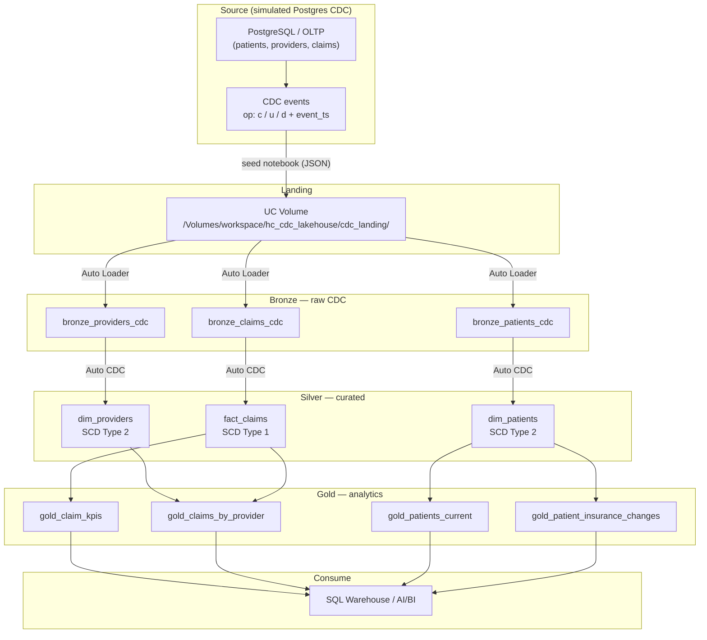

# Architecture

End-to-end **Postgres-style CDC → Databricks Lakehouse → Analytics** for healthcare claims data.

## Overview

## Layers

| Layer | Mechanism | Purpose |
|-------|-----------|---------|
| **Source** | OLTP / Postgres-style tables | Operational patients, providers, claims |
| **Landing** | Unity Catalog volume (JSON) | CDC change feed on disk (Debezium-style `c`/`u`/`d`) |
| **Bronze** | Auto Loader streaming tables | Append-only raw CDC events |
| **Silver** | Auto CDC | SCD2 dimensions + SCD1 claim facts |
| **Gold** | Materialized views | KPIs and history ready for SQL / AI/BI |
| **Orchestration** | Databricks Job | Seed landing → refresh Lakeflow pipeline |

## SCD semantics

- **SCD Type 2** (`dim_patients`, `dim_providers`): full history with `__START_AT` / `__END_AT`. Current rows: `WHERE __END_AT IS NULL`.
- **SCD Type 1** (`fact_claims`): latest claim status and amounts only (upsert / delete by `claim_id`).

## Catalog objects

| Layer | Objects |
|-------|---------|
| Landing | `/Volumes/workspace/hc_cdc_lakehouse/cdc_landing/{patients,providers,claims}` |
| Bronze | `bronze_patients_cdc`, `bronze_providers_cdc`, `bronze_claims_cdc` |
| Silver | `dim_patients`, `dim_providers`, `fact_claims` |
| Gold | `gold_claim_kpis`, `gold_claims_by_provider`, `gold_patients_current`, `gold_patient_insurance_changes` |

Schema: `workspace.hc_cdc_lakehouse`

## Code map

| Path | Role |
|------|------|
| `src/seed/seed_postgres_cdc.py` | Writes simulated CDC JSON to the volume |
| `src/.../transformations/bronze_*.py` | Auto Loader → bronze CDC tables |
| `src/.../transformations/silver_*.py` | Auto CDC → SCD2 dims / SCD1 facts |
| `src/.../transformations/gold_*.py` | Gold materialized views |
| `resources/cdc_lakehouse.job.yml` | Job: seed → SDP pipeline |
| `resources/healthcare_cdc_scd_etl.pipeline.yml` | Lakeflow Declarative Pipeline |

## Related: standalone dbt project

dbt lives in a **separate** folder/repo: `healthcare-cdc-dbt` (not nested here).

## Production path

Replace the seed notebook with **Lakeflow Connect**, **JDBC**, or real Postgres/Lakebase CDC into the same volume (or bronze Delta). Silver Auto CDC and Gold views stay the same.
